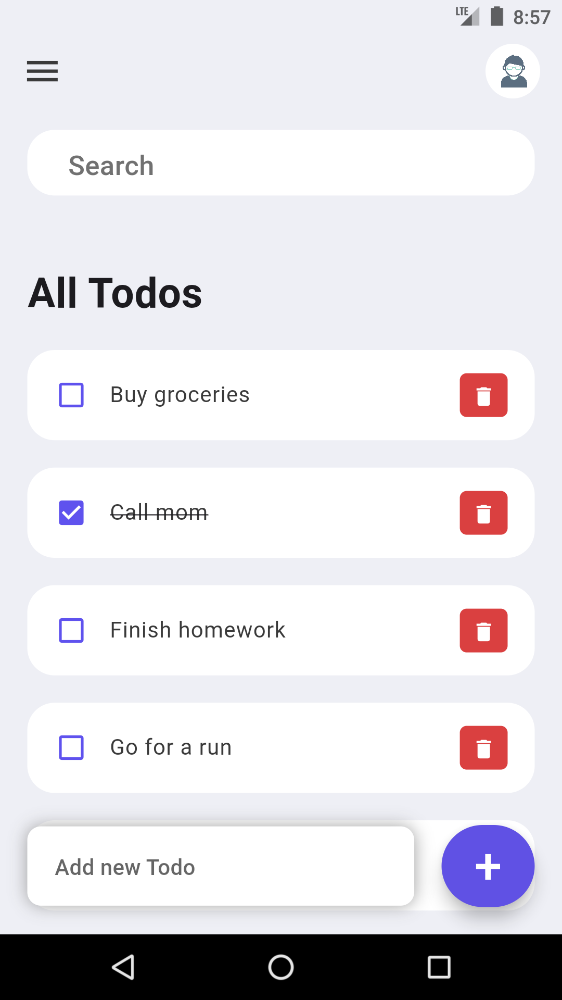

# Todo List App

A simple todo list app built with Flutter.

## Introduction

The Todo List App is a mobile application designed to help users organize their tasks efficiently. Users can add, delete, and mark tasks as done, making it easy to keep track of their daily activities.

## Features

- Add new tasks to the todo list
- Delete tasks from the todo list
- Mark tasks as done or undone
- Simple and intuitive user interface

## Installation

### Prerequisites

- Flutter SDK installed
- Emulator or physical device to run the app

### Steps

1. Clone the repository:

git clone https://github.com/your_username/todo_list_app.git

2. Navigate to the project directory:

cd todo_list_app

3. install dependencies:

flutter pub get

4. Run the app:

flutter run

## Usage

1. Launch the app on your device or emulator.
2. You'll see a list of tasks already added.
3. To add a new task, tap on the '+' button at the bottom right corner.

4. Enter the task details and tap 'Save'.
5. To mark a task as done, tap on the checkbox next to the task.
6. To delete a task, swipe left on the task and tap on the delete icon.
7. Your tasks will be saved automatically.

## Contributing

Contributions are welcome! If you'd like to contribute to the project, please follow these steps:

1. Fork the repository.
2. Create a new branch (`git checkout -b feature/improvement`).
3. Make your changes.
4. Commit your changes (`git commit -am 'Add new feature'`).
5. Push to the branch (`git push origin feature/improvement`).
6. Create a new Pull Request.

## License

This project is licensed under the [MIT License](LICENSE).

